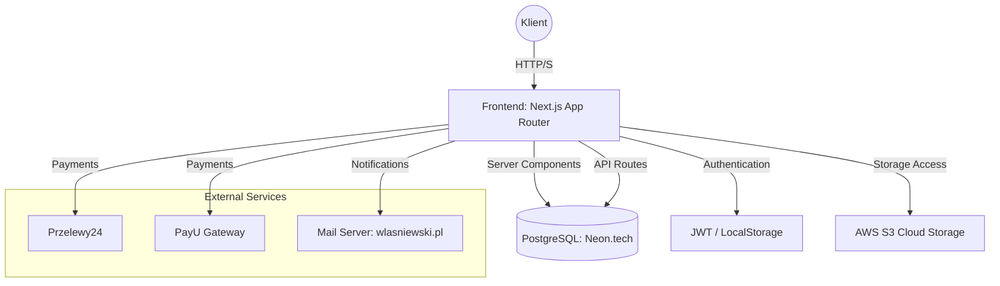
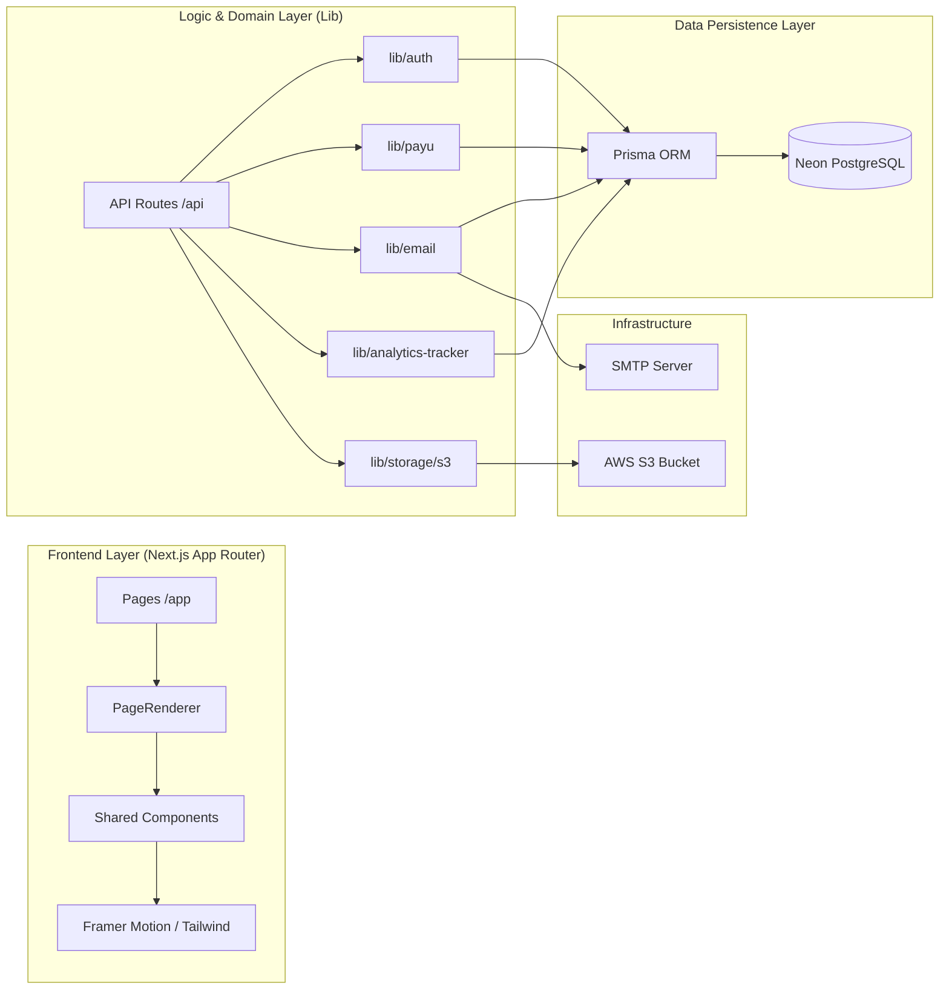
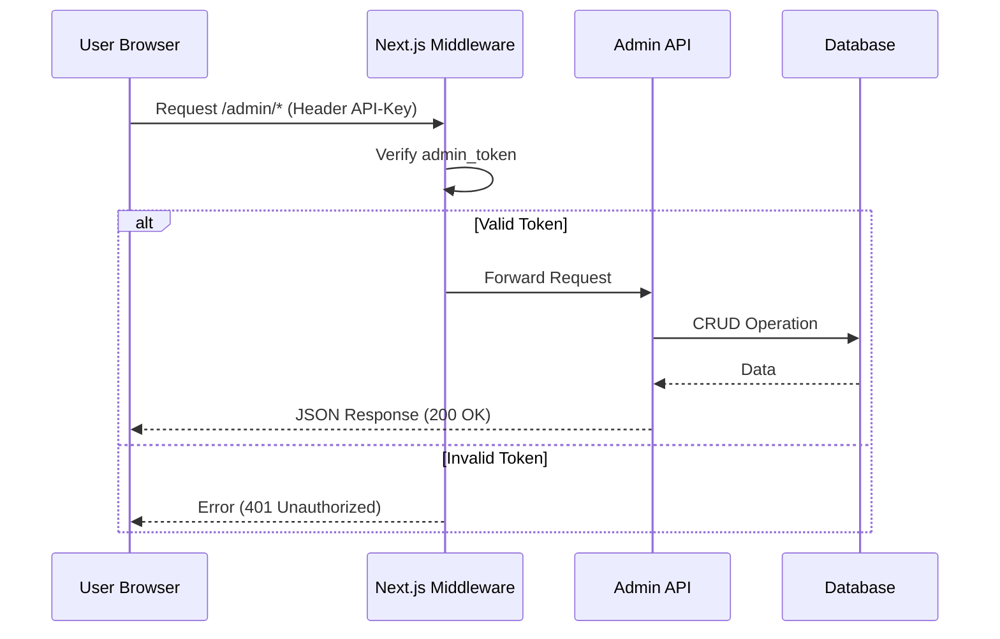

# ARCHITEKTURA SYSTEMU - wlasniewski.pl

Ten dokument stanowi techniczny blueprint platformy fotograficznej wlasniewski.pl. Jest on przeznaczony dla senior deweloperów i architektów systemowych, opisując strukturę, wzorce projektowe oraz krytyczne protokoły bezpieczeństwa.

## Aktualizacja 2026-08-03 — architektura indeksu Portfolio

- `PortfolioIndexViews` jest wspólnym rendererem dwóch układów indeksu; otrzymuje ten sam kontrakt danych kategorii/sesji i nie ingeruje w źródła mediów.
- Wybrany wariant przechowuje rekord KV `Setting.setting_key=portfolio_index_layout` z walidowanymi wartościami `chapters` albo `cinematic_contact`; brak ustawienia bezpiecznie wybiera `chapters`.
- Zapis przez chronione `/api/settings` unieważnia `/portfolio`. Operacje CRUD sesji unieważniają tagi `portfolio`, `portfolio-sessions` oraz ścieżkę indeksu.
- Trasa szczegółu filtruje po `slug`, kategorii bez rozróżnienia wielkości znaków oraz `is_published=true`, co usuwa alternatywne adresy i publiczne renderowanie szkiców.

## Aktualizacja 2026-08-03 — warstwa wizualna homepage 2026

- `page.tsx` preferuje `Page.sections`, następnie legacy `home_sections`, a dopiero przy braku obu używa `homepageProductionFallback`; ta kolejność gwarantuje nadrzędność edytowalnych danych CMS.
- `MagazineLayout`, `NarrativeText` i `StoriesGrid` zachowują istniejące kontrakty pól panelu. Warstwa renderująca normalizuje wyłącznie wygląd i hierarchię nagłówków, bez przepisywania zapisanej treści; kopia awaryjna korzysta z już zoptymalizowanych wariantów zdjęć produkcyjnych.
- `HeroSlider` współdzieli pełnoekranową kompozycję, shadery, typografię i CTA pomiędzy slajdami CMS oraz odpornym fallbackiem.
- `HomeContent` porządkuje publiczną ścieżkę: hero → wybór usług → moduły CMS → poradnik → karta podarunkowa → Local SEO → CTA → kontakt.
- Klasa `.home-editorial` izoluje typografię strony, a `.home-cms-flow` harmonizuje istniejące moduły bez modyfikacji ich kontraktów danych i bez wpływu na pozostałe podstrony.
- Responsywne obrazy, jeden ukryty H1, semantyczne H2/H3, reduced motion i fokus klawiatury pozostają częścią kontraktu dostępności oraz SEO.
- Opcjonalne `home_sections.service_cards` przechowuje trzy konfiguracje kafli (`image`, `image_mobile`, `image_position` i teksty); brak pola uruchamia bezpieczne wartości domyślne.
- Flagi `cmsUnavailable`, `sectionParseFailed` i `testimonialsUnavailable` odróżniają awarię danych od świadomie pustej konfiguracji, więc fallback nie nadpisuje decyzji administratora.
- `.home-dark-section` wyłącza wybrane moduły z jasnej normalizacji `.home-cms-flow`; opinie zachowują kontrast, a ich wysokość wynika z treści zamiast stałego kontenera.

## Aktualizacja 2026-08-02 — moduł promocji poradnika na homepage

- `HomeContent` renderuje jasny, responsywny moduł poradnika po sekcjach CMS i przed kartą podarunkową.
- Dedykowany zasób `public/images/home/session-guide-family-v2.webp` ma 1536×1024 px i około 160 KB; `next/image` dobiera wariant do viewportu.
- Wszystkie trzy powierzchnie linkujące prowadzą do kanonicznego `/jak-sie-ubrac` bez parametrów zapytania.
- `HeroSlider` utrzymuje jeden stały H1 dokumentu, a zmienne tytuły slajdów i wariant before/after są H2.

## Aktualizacja 2026-08-02 — CMS publicznego poradnika

- Dedykowany renderer `app/jak-sie-ubrac` zachowuje wygląd i schema Article/FAQ, ale pobiera walidowany JSON z rekordu `Page.slug=jak-sie-ubrac`.
- Kontrakt danych i bezpieczny fallback znajdują się w `src/lib/publicGuideCms.ts`; prywatny `preparationGuideCms` pozostaje całkowicie oddzielony.
- Chroniony endpoint administratora `/api/pages/public-guide` waliduje dane, aktualizuje istniejący rekord przez upsert i odświeża stronę oraz sitemapę.
- Dedykowany edytor ma pierwszeństwo przed ogólną trasą edycji Pages i korzysta z MediaPicker oraz istniejących pól SEO modelu Page, bez migracji bazy.
- Niekompatybilny legacy content nie steruje stroną publiczną do czasu pierwszego bezpiecznego zapisu; wtedy zostaje zastąpiony wersjonowanym JSON-em.

## Aktualizacja 2026-08-02 — zasoby kart i nieblokujące integracje

- Dziesięć kart póz znajduje się w `public/images/public-guide/pose-cards/`; każda ma format WebP, szerokość 800 px i mniej niż 100 KB.
- Opisy kart pozostają w HTML Server Componentu, więc tekst nie zależy od odczytu treści osadzonej w rastrze.
- `AuthContext` oddziela pasywne czyszczenie nieważnej sesji od jawnej operacji `logout`, która nadal przekierowuje do `/logowanie`.
- `Navbar`, `AnalyticsLoader` i strona główna traktują brak opcjonalnych danych jako stan fallbacku, a nie błąd renderowania publicznej strony.

## Aktualizacja 2026-08-01 — krytyczna ścieżka strony głównej

- `HeroSlider` nie blokuje już SSR flagą `mounted`; pierwszy slajd lub fallback powstaje w serwerowym HTML.
- Responsywne `<picture>` pozwala przeglądarce pobrać jeden właściwy wariant obrazu, a `fetchpriority=high` wspiera LCP pierwszego slajdu.
- `prefers-reduced-motion` zatrzymuje autoplay i skalowanie hero.
- Wysokość hero wynosi 68svh z bezpiecznym minimum, bez poprzedniego pełnoekranowego 90–100vh.
- `generateMetadata` i `getHomePageData` izolują awarię Prisma i zwracają statyczne wartości domyślne bez zmiany schematu lub danych.
- Kontrakty regresji znajdują się w `tests/e2e/homepage.contract.spec.ts`; helper sprawdza rzeczywisty SSR komponentu.

## Aktualizacja 2026-08-01 — publiczny poradnik SEO

- `src/app/jak-sie-ubrac/page.tsx` jest statycznym Server Componentem, dzięki czemu pełna treść trafia do HTML i nie zależy od PostgreSQL.
- Strona ma własne metadata oraz graf JSON-LD: `Article`/`WebPage`, `Person`, `BreadcrumbList` i `FAQPage`.
- Publiczny kod nie importuje `preparationGuides`, `POSE_GUIDE_CARDS`, klientowego endpointu ani Prisma.
- Warstwa artykułu odwołuje się do dziesięciu wybranych zasobów WebP przez `next/image`; siedem nowych zoptymalizowanych przykładów znajduje się w `public/images/public-guide/` i jest współdzielonych z zapowiedzią produktu. Pełna biblioteka pozostaje w chronionym module klienta.
- Strona zapowiedzi produktu ma wyłącznie schemat `WebPage`. `Product`/`Offer` należy dodać dopiero wraz z prawdziwą ceną i dostępnością.
- Kontrakt renderowania i separacji prywatnych danych: `tests/e2e/public-guide.render.spec.tsx`.

## Aktualizacja 2026-08-01 — CMS poradnika klienta

- `PreparationGuideEditor` obsługuje wersjonowany dokument `PreparationGuideCmsData` i wykorzystuje istniejący `MediaPicker`.
- `GET/POST /api/pages/preparation-guide` są chronione przez `withAdminAuth`; zapis wykonuje `Page.upsert` dla slugu `przygotowanie-klienta`.
- `preparationGuideCmsSchema` wymusza dokładnie 15/7/3/12/30 elementów, unikalne ID, limity treści, kolory `#RRGGBB` i bezpieczne adresy obrazów.
- Wspólny `isAllowedPublicMediaUrl` dopuszcza ścieżki aplikacji i HTTPS z właściwego zasobnika S3; używają go zapis CMS, scalanie palet i `PaletteGuideCard`.
- `/api/style-guide/client` odczytuje dokument serwerowo i przekazuje go dopiero po autoryzacji klienta; uszkodzony lub nieistniejący dokument nie przerywa działania, tylko uruchamia fallback.
- Rozwiązanie wykorzystuje istniejącą tabelę `pages`, dlatego wdrożenie nie wymaga migracji Prisma.

## Aktualizacja 2026-08-01 — komponenty mobilnego panelu i model pozy

- `AccountTabButton` jest wspólnym komponentem nawigacji klienta z widoczną etykietą, ikoną, licznikiem i stanem aktywnym.
- `PoseGuideCard` nie zawiera już pola `mistake`; interfejs renderuje wyłącznie krótkie instrukcje i naturalne alternatywy.
- Testy przeglądarkowe kontrolują etykiety nawigacji, minimalną wysokość dotykową, szerokość 320 px i powiększenie 200%.

## Aktualizacja 2026-07-29 — trwałość leadów i warstwa publiczna

- `POST /api/contact`: walidacja → zapis `Inquiry` → próba powiadomienia SMTP.
- `PATCH /api/inquiries`: chroniona zmiana statusu z zamkniętą listą wartości.
- Ustawienia analityki korzystają z `unstable_cache` z rewalidacją 3600 s.
- `next/image` negocjuje AVIF/WebP, a CSS Swipera jest bundlowany lokalnie.

---

## Aktualizacja 2026-07-31 — Przygotowanie klienta i stabilność buildu

- Prywatny poradnik jest wystawiany przez `/api/style-guide/client`; handler weryfikuje token, aktywność użytkownika oraz własność oferty.
- Statyczne treści zastępcze pozostają po stronie serwera i nie są importowane przez komponent kliencki.
- Wspólna reguła `styleGuideAccess` wyklucza kategorię `pose` ze wszystkich publicznych ścieżek odczytu.
- Ilustracje poradnika są zoptymalizowanymi zasobami WebP w `public/images/client-guides`.
- `wardrobeTipImages` semantycznie przypisuje istniejące ilustracje do porad CMS bez obrazu, z bezpiecznym fallbackiem.
- `wardrobePaletteImages` scala częściowy zestaw CMS z kuratorowanymi paletami, rezerwuje kanoniczne `city-light` i dopuszcza wyłącznie obrazy z allowlisty istniejących zasobów garderoby.
- Fonty aplikacji są self-hosted przez `next/font/local`, więc build nie zależy od Google Fonts.
- `scripts/prisma-generate-local.js` wykrywa lokalne silniki Prisma dla bieżącej platformy i propaguje błędy generatora.
- `outputFileTracingRoot` wskazuje bieżący katalog projektu, stabilizując standalone build w środowiskach z nadrzędnymi lockfile'ami.

## 1. System Overview & Tech Stack

Platforma jest nowoczesną aplikacją webową zbudowaną w architekturze **Serverless First**, kładącą nacisk na wydajność (Core Web Vitals) oraz stabilność danych.

### 1.1. Core Stack
*   **Framework**: [Next.js 15 (App Router)](https://nextjs.org/) - wykorzystanie Server Components (RSC) dla optymalizacji LCP.
*   **Język**: TypeScript (Strict Mode) - gwarancja bezpieczeństwa typów w całym przepływie danych.
*   **Baza Danych**: PostgreSQL (Neon.tech) - relacyjna baza danych z obsługą Serverless Driver.
*   **ORM**: Prisma - warstwa abstrakcji danych z silnym typowaniem modeli.
*   **Storage**: AWS S3 - magazyn binarny dla mediów wysokiej rozdzielczości.
*   **UI/UX**: Tailwind CSS + Framer Motion - system mikro-animacji i responsywnego stylowania.
*   **Płatności**: Integracja REST API z Przelewy24 oraz PayU (obsługa webhooków).

---

## 2. Architektura Wysokiego Poziomu (High-Level Design)

### 2.1. Client Portal Architecture (v3.0 Add-on)
Architektura serwisu została rozszerzona o bezpieczny portal klienta:
- **Route**: `${domain}/konto` (Ujednolicony dostęp).
- **Auth**: Niezależny system logowania dla klientów (User Role: `CLIENT`).
- **Data Access**: Klient ma dostęp wyłącznie do rekordów (`Offer`, `Contract`, `Booking`, `ClientGallery`) powiązanych z jego `UserId` lub e-mailem.
- **Interakcja**: Portal wykorzystuje Server Components i API Routes do bezpiecznej komunikacji z klientem.
- **Safety**: Wszystkie interakcje w dashboardzie (`konto/page.tsx`) są zabezpieczone przed `null pointers` przy dostępie do nieistniejących jeszcze ofert czy umów.

---

## 3. Kluczowe Wzorce i Protokoły (The "Holy" Principles)

Projekt opiera się na trzech autorskich protokołach gwarantujących niezawodność systemu.

### 3.1. Protokół "Zero Flower" (Dynamic Fallback Strategy)
Każda podstrona zarządzana przez CMS (tabela `Page`) musi posiadać mechanizm fallbacku. Jeśli rekord w bazie danych zostanie usunięty lub nie zawiera sekcji, `PageRenderer` wstrzykuje statyczną treść awaryjną („Anti-Flower”), zapobiegając renderowaniu pustych stron. Przykładem dynamicznej kontroli UI jest sekcja **Info Band**, gdzie linki "Szczegóły operacyjne" renderowane są warunkowo (tylko gdy zdefiniowano URL).

### 3.2. "Holy Logic" (Business Integrity)
Zbiór reguł krytycznych dla operacji biznesowych:
*   **Płatności**: Żaden status rezerwacji/zamówienia nie może zostać zmieniony na `confirmed` przed otrzymaniem poprawnego podpisu Webhooka z bramki płatniczej.
*   **Security**: Wszystkie trasy `/admin/*` są chronione przez autorski Middleware sprawdzający `admin_token` z `localStorage` oraz nagłówki `Authorization`.

### 3.3. Protokół "Zero Loss" (Data Persistence & Versioning) [UPDATE: 2025-12-30]
Wdrożono zaawansowany system kopii zapasowych oparty na dwóch skryptach:
- **`scripts/backup-docs.js`**: Monitoruje zmiany w dokumentacji i tworzy automatyczne backupy w `backups/documentation/` przed każdym buildem.
- **`scripts/backup-full.ts`**: Eksportuje stan wszystkich 40 tabel bazy danych (Modele Prisma) do sformatowanych plików JSON. Backupy są kategoryzowane czasowo (`backups/[TIMESTAMP]/`), co pozwala na atomowe przywracanie konkretnych punktów w czasie.
- **`scripts/restore-full.ts`**: Skrypt przywracający, realizujący logikę **TRUNCATE CASCADE** (czyszczenie) oraz **UPSERT** (bezpieczne wstrzykiwanie danych).
- **Zasada "File vs Folder"**: Backupem jest wyłącznie plik JSON. Kopiowanie folderów jest zabronione.
- **Holy File**: Referencyjny backup "Holy Backup" znajduje się zawsze w `backups/data/[TIMESTAMP]_HOLY_BACKUP`.
- **Cel**: Ochrona „świętej treści” (Blog, Portfolio, Ustawienia, B2B) przed destrukcyjnymi operacjami schematu lub awariami dostawcy bazy danych. Służy również jako mechanizm bezpiecznego deployu ("Backup-Before-Push").

### 3.5. Protokół "GDPR Safe Harbor" (Soft Anonymization) [NEW: 2026-01-11]
W odpowiedzi na wymogi RODO (prawo do bycia zapomnianym) przy jednoczesnym zachowaniu wymogów księgowych, wdrożono hybrydowy system usuwania danych.
- **Problem**: Tradycyjne `DELETE FROM users` narusza integralność relacyjną zamówień (Gift Cards) i historii rezerwacji, uniemożliwiając raportowanie przychodów.
- **Rozwiązanie**: Funkcja `anonymizeClient` w API wykonuje "Soft Delete":
    1. Pola PII (`name`, `email`, `phone`, `recipient_name`, `sender_name`, `message`) są nadpisywane pseudonimami (np. `REMOVED-GDPR`).
    2. Identyfikator `email` (Unique) zmieniany jest na losowy hash (np. `deleted-uuid@deleted.local`) aby zwolnić adres dla nowej rejestracji.
    3. Konto otrzymuje flagę `is_active: false`.
    4. Rekordy w tabelach finansowych (`GiftCardOrder`, `Booking`) pozostają, ale bez danych osobowych.

### 3.4. "Scope Isolation" (Atomic Integrity) [NEW: 2025-12-25]
Zasada nienaruszalności modułów niezwiązanych z bieżącym zadaniem. Agent/Deweloper ma obowiązek wykonywania zmian **wyłącznie** w zakresie wskazanym przez USERA. 
*   **Zakaz Rewritu**: Zabrania się przesyłania całych plików tam, gdzie zmiana dotyczy tylko konkretnej sekcji.
*   **Zakaz Ingerencji Po Buildzie**: Absolutny zakaz modyfikacji danych produkcyjnych lub konfiguracyjnych wykraczających poza zlecony zakres operacji.
*   **Verification First**: Każda zmiana w krytycznych plikach (np. `settings/page.tsx`) musi być poprzedzona analizą `view_file`.

---

## 4. Przepływ Danych (Data Flow Diagrams)

### 4.2. Offer & Contract Flow (Client Portal) [IMPLEMENTED: 2026-02-19]
Logika biznesowa dokumentów została ujednolicona w ramach v3.0:
- **Standalone Contracts**: Model `Contract` pozwala na tworzenie dokumentów niezależnych od ofert (`offer_id` is Optional).
- **Server-Side Placeholder System**: System automatycznie zamienia tagi `{{contractNumber}}`, `{{clientName}}`, `{{currentDate}}` na realne dane podczas:
    1. Zapisu/Aktualizacji (`POST /api/admin/contracts`)
    2. Pobierania pojedynczego dokumentu (`GET /api/client/portal/contracts/[id]`)
    3. Pobierania profilu użytkownika (`GET /api/user/me`)
- **Mandatory Signature Logic**: System weryfikuje obecność `signature` administratora przed commitowaniem zmian do bazy.
- **Status Management**: Synchronizacja statusów między Ofertą a Umową (Accepted Offer -> Trigger Contract Creation).

---

## 5. Drzewo Zależności i Cykl Życia Modułów (Dependency Tree)

Poniżej przedstawiono graficzną reprezentację zależności systemowych oraz kategoryzację stosu technologicznego.

### 5.1. Graf Zależności Internal (Mermaid)

### 5.2. Kategoryzacja Zależności Zewnętrznych (package.json)

| Kategoria | Biblioteki | Cel |
| :--- | :--- | :--- |
| **Rdzeń** | `next`, `react`, `react-dom` | Framework i biblioteka UI. |
| **Data Engine** | `prisma`, `@prisma/client` | ORM i generowanie typów DB. |
| **Bezpieczeństwo** | `jose`, `bcryptjs` | Obsługa JWT i hashowanie haseł. |
| **Infrastruktura** | `@aws-sdk/client-s3`, `nodemailer` | Przechowywanie plików i wysyłka e-mail. |
| **E-commerce** | `stripe`, `payu.ts` (custom lib) | Obsługa płatności kartowych i przelewów. |
| **UI/UX** | `framer-motion`, `lucide-react`, `tailwind-merge`, `sonner` | Animacje, ikony, stylowanie i powiadomienia. |
| **Analityka** | `recharts`, `date-fns` | Wykresy BI i manipulacja czasem. |
| **Walidacja** | `zod`, `react-hook-form` | Schematy danych i obsługa formularzy. |

---

## 6. Model Danych (Schema Design)

System wykorzystuje znormalizowany model danych z silnymi relacjami.

| Moduł | Kluczowe Modele | Charakterystyka |
| :--- | :--- | :--- |
| **Identity** | `User` | Role: ADMIN/CLIENT. Dane profilowe + adresowe. |
| **CMS** | `Page`, `MenuItem` | Hierarchiczna nawigacja, JSON Sections. |
| **E-commerce** | `Booking`, `GiftCard`, `Offer`, `Contract` | Flow sprzedażowy i dokumentacyjny. |
| **Media** | `MediaLibrary` | Metadane S3, optymalizacja formatów. |
| **Analytics** | `AnalyticsEvent` | Śledzenie konwersji, BI Dashboard. |

---

## 7. Topologia API i Infrastruktura Runtime

Architektura oparta na **Edge-ready API Routes**, zapewniająca minimalne opóźnienia w komunikacji klient-serwer.

### 7.1. Przepływ Autoryzacji i Middleware (Twin-Engine Routing)
System wykorzystuje `middleware.ts` do inteligentnego routingu ruchu:
1. **Domain Detection**: Sprawdza nagłówek `Host`.
2. **Context Switching**: Rewriting URL do `/b2b` dla odpowiednich hostów.
3. **Auth Check**: Weryfikacja tokenów dla ścieżek `/admin` oraz `/api/client/portal`.

### 7.2. Zależności Infrastrukturalne (Platform Overlays)
- **Database Engine**: PostgreSQL 16+ na Neon.tech (z obsługą połączeń poolingowych).
- **Edge Runtime**: Netlify Functions (Node.js runtime z limitem bundla 250MB).
- **Blob Storage**: AWS S3 Cluster (region eu-north-1) z polityką Public Read dla mediów.
- **SMTP Gateway**: mail.wlasniewski.pl (obsługa TLS z flagą `rejectUnauthorized: false` dla serwerów self-signed).

### 7.3. Modular Settings API
System przechodzi na architekturę rozproszonej konfiguracji:
- **/api/settings**: Zarządza globalnymi ustawieniami (Płatności, SEO, SMTP).
- **/api/photo-challenge/settings**: Dedykowany endpoint dla modułu wyzwań (HQ, Radius, FOMO).
Zapewnia to lepszą izolację kodu i mniejsze ryzyko regresji podczas edycji panelu administratora.

---

## 8. Bezpieczeństwo i Infrastruktura

### 6.1. Deployment Pipeline
Proces wdrożenia oparty na Netlify CI/CD. Kluczowym elementem jest oddzielenie środowisk (Staging vs Production) poprzez `DATABASE_URL`.
> [!CAUTION]
> Zakaz używania `prisma db push` na produkcji. Wszystkie zmiany schematu muszą przechodzić przez `prisma migrate deploy`.

### 6.2. Optymalizacja Mediów
Wszystkie zdjęcia w portfolio przechodzą przez proces optymalizacji:
1. Upload do S3 (Original).
2. Serwowanie przez Next.js `Image` component z filtrem `WebP/AVIF`.
3. Leniwe ładowanie (Lazy Loading) dla galerii masowych.

---

### 7.2. Runtime Optimization & Caching [UPDATE: 2026-02-19]
- **Vercel S3 Redirect**: `GET /api/offers/[id]/pdf` przekierowuje bezpośrednio do S3, unikając blokowania runtime'u serverless przez ciężkie procesy generowania PDF.
- **Edge-Ready JWT**: Wykorzystanie `jose` do weryfikacji tokenów w Middleware.

---

## 8. Status Produkcyjny

System jest oceniony jako **100% Ready for Production**. Wszystkie krytyczne błędy (w tym błędy zapisu ustawień, limity rozmiaru bundli na Netlify oraz opóźnienia synchronizacji analityki) zostały wyeliminowane w grudniu 2025 r.

---

*Opracowane przez: Senior Architect Antigravity*
*Ostatnia aktualizacja: 2026-02-19*
